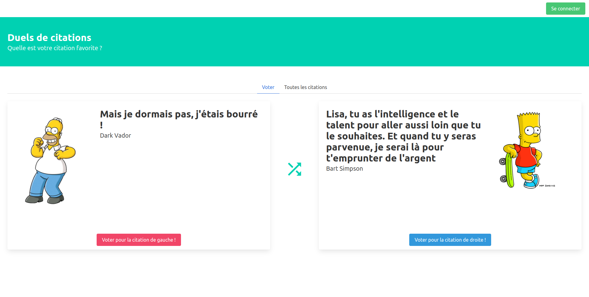

# Quote duel
#### Programmation Fonctionnelle pour le Web (2021)

## Sujet

Projet réalisé dans le cadre de l'UE Programmation Fonctionnelle pour le Web ([INF2026L](https://prac-odfv8.univ-lyon1.fr/%2Fue-16369-275%2Fprogrammation-fonctionnelle-pour-le-web.html)) à l'Université Claude Bernard Lyon 1.  
  
L'objectif de ce projet est de réaliser la partie client, entièrement en JavaScript, d'une application de classement des meilleures citations issues de séries et de films.  
L’application va permettre de réaliser des duels de citations et d’ajouter de nouvelles citations aux citations déjà présentes. L’intégralité du serveur REST (backend) est fournie.  
L'utilisation du framework CSS [Bulma](https://bulma.io/) est obligatoire.

	

## Fonctionnalités de l’API REST

Le serveur gère deux types de données :
- **Utilisateur**: chaque utilisateur possède une clé d’API qui lui permet d’interagir avec le serveur. Il est possible de vérifier sa clé d’API, par contre il n’est pas possible de changer un utilisateur.
- **Citation**: en plus d’un identifiant et du texte de la citation, on dispose des informations suivantes: le personnage, la série ou le film d’origine de la citation, un lien vers une image du personnage, la direction du personnage dans l’image, le login de l’utilisateur ayant ajouté l’image et enfin un dictionnaire indiquant le nombre de duels gagnés et perdus face à chaque autre citation. Il est possible de récupérer les informations d’une ou de toutes les citations, d’ajouter une nouvelle citation ou de modifier une des citations que l’on a précédement ajouté. Enfin il est possible e déclarer le résultat d’un duel de citations.

## Fonctionnalités implémentées

| Fonctionnalité | Nombre de points |
| - | :-: |
| Affichage de l’ensemble des citations du serveur  | 2 |
| Affichage d'un duel aléatoire | 4 |
| Connexion utilisateur | 4 |
| Ajout de citation | 4 |
| Détails d'une citation | 4 |
| Vote  | 4 |
| Fonctionnalité au choix: repiocher deux citations | ? |

**🏆 Note finale: 18 / 20**

## Liens utiles

Page du projet: [Duel de citations - LIFAP5](http://emmanuel.coquery.pages.univ-lyon1.fr/enseignement/lifap5/projet_2021p/)  
Serveur: [https://lifap5.univ-lyon1.fr/](https://lifap5.univ-lyon1.fr/)  
Documentation du serveur: [https://lifap5.univ-lyon1.fr/api-docs/](https://lifap5.univ-lyon1.fr/api-docs/)
